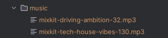

# Fact Bot - Generate Instagram Reel Facts

## Setup:
```shell
python3 -m pip venv .venv
source ./venv/bin/activate
pip install -r requirements.txt

mv .env.example .env
```

- Create a Pexels API Account at: https://www.pexels.com/api/  
- Insert your Pexels API Key into the `.env` file:
```dotenv
VIDEO_API_KEY=# Replace with API Key from https://www.pexels.com/api/
```


## How to use it:

### Requirements:
- Music folder (`music/`)  
Example:

- Fact file (`facts.txt`)  
Example:
```text
Python is an awesome programming language!
Using this bot makes a lot of fun!
```

### Generate a fact Reel:
```shell
python3 bot.py
```
